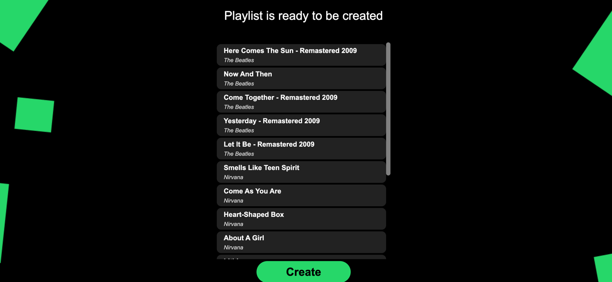

<h1 align="center">🔀 toShuffle() 🔀</h1>

   
  <i>Shuffle your favorite artist</i>
   

  <a href="https://toshuffle-e8e2e3c9f502.herokuapp.com/" target="_blank" rel="noreferrer noopener"><strong>https://toshuffle-e8e2e3c9f502.herokuapp.com/</strong></a>
   

___

## 🌟 Overview
`toShuffle` is a Java application designed to enhance your Spotify listening experience. Tired of manually creating playlists for a one-time session with various artists? `toShuffle` automates this process, generating custom playlists in Spotify with your favorite tunes.

## ✨ Features
- **🔀 Automated Playlist Creation:** Generates a Spotify playlist on your account with the top 5 songs from each of three chosen artists.
- **🔍 Artist Search Functionality:** Easy-to-use in-app search to find and select your favorite artists.
- **🚀 Spring Boot Application:** Developed with Spring Boot for easy deployment and scalability.

## 🛠 Technologies and Libraries
- **Spring Boot:** Robust framework for building stand-alone applications.
- **SLF4J:** Simplified logging.
- **Mockito:** For efficient and straightforward testing.
- **Spotify Web API Java:** Integrates Spotify's rich music database.
- **OAuth2:** Secure authentication with Spotify API.
- **Front-End Magic:** Simple yet interactive front-end using JavaScript and CSS.

## 🎶 Usage
1. **Open in Browser:** Access the web interface.
2. **Search Artists:** Use the search to pick your artists.
3. **Generate Playlist:** Create your playlist with a click.
4. **Enjoy on Spotify:** Find the newly created playlist in your Spotify account.

## 🏞️ View

## 🙌 Personal Touch
I'm thrilled to bring my vision to life, being able to create my own playlist from various artists just as I've always wanted. It's incredibly fulfilling to use my programming skills to realize this idea. The joy of blending music and coding to craft something uniquely mine is indescribable.

## 📝 Note
This project is a personal venture and is not affiliated with Spotify. It showcases API integration and automation using Java and Spring Boot.

## ©️ License
This project is open source.
